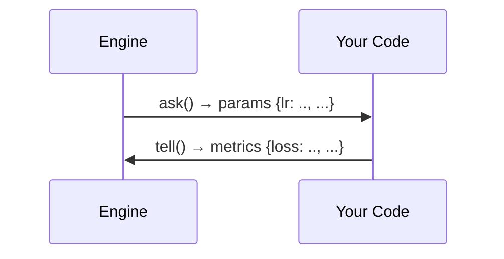

# Concepts

This page explains the core ideas behind HOLA's optimization
pipeline. For API specifics, see the [Python Guide](python-guide.md),
[CLI Guide](cli-guide.md), or [REST API Reference](rest-api.md).

## The Ask/Tell Paradigm

We separate **suggestion** from **evaluation**.

1. **Ask.** The engine suggests a set of parameter values to try.
2. **Evaluate.** Your code runs with those parameters and produces
   metrics.
3. **Tell.** You report the metrics back to the engine.

This decoupling allows the same engine to work locally (Python
`Study`), over a network (REST API / `Study.connect()`), or in a
distributed setting with a server and multiple workers.



## Architecture

We organize HOLA into three layers. The **engine core** is a Rust
optimization library that handles spaces, strategies, transformers,
and the leaderboard. The **orchestration layer** wraps the engine
core behind a JSON-based interface so that spaces and strategies
can be resolved at runtime from configuration. The **public
interfaces** (Python bindings, CLI, and REST server) all delegate
to the orchestration layer, so users never interact with Rust
internals directly.

For day-to-day work we recommend the Python API. The Rust internals
are an implementation detail you do not need to think about.

## Data Flow

We route every trial through the same pipeline.

```
ask()
  ├─ Strategy proposes candidate in [0,1]^n (unit hypercube)
  ├─ Space maps [0,1]^n → domain values (e.g., lr=0.001, layers=5)
  └─ Returns JSON params dict to caller

evaluate (your code)
  └─ Returns JSON metrics dict (e.g., {"loss": 0.42, "latency": 120})

tell()
  ├─ Transformer validates metrics against objective schema
  ├─ Transformer scalarizes metrics → single observation (f64)
  ├─ Leaderboard stores the trial (params, score_vector, metrics, timestamp)
  └─ Strategy updates its model from the new observation
```

## The Unit Hypercube

All strategies operate internally in the **unit hypercube**
$[0,1]^n$, where $n$ is the number of dimensions. We define a
bijection between $[0,1]^n$ and the actual domain.

- `to_unit_cube(domain_value)` $\to [0,1]$ normalizes a domain
  value.
- `from_unit_cube(unit_value)` $\to$ `domain_value` denormalizes
  back to the domain.

This standardization means strategies never need to know about
parameter scales or types. They always propose uniform vectors in
$[0,1]^n$, and the space handles the mapping.

## Scale Transformations

We support three scales for real-valued parameters.

**Linear** (default). Uniform sampling in the domain. Use this for
parameters where all values in the range are equally plausible.

```python
Real(0.0, 1.0)  # samples uniformly from [0, 1]
```

**Log10.** Uniform sampling in $\log_{10}$ space. Use this for
parameters spanning orders of magnitude. Learning rates are a
classic example.

```python
Real(1e-4, 0.1, scale="log10")  # samples uniformly from 10^(-4) to 10^(-1)
```

A value of 0.5 in the unit hypercube maps to
$10^{-2.5} \approx 0.00316$, not $0.05$.

**Log.** Uniform sampling in natural log space. Available in Python
as `Real(a, b, scale="log")`.

## Search Strategies

### GMM Strategy (default) {#gmm-strategy}

The default strategy is the
[Gaussian Mixture Model](https://en.wikipedia.org/wiki/Mixture_model#Gaussian_mixture_model).
We fit a GMM to the **top quantile** of completed trials, then
sample new candidates from the fitted model. This concentrates
samples in regions where good results have been observed.

The lifecycle follows three phases.

1. **Warmup.** The first trials build up the leaderboard.
2. **Refit.** Every `refit_interval` trials (default 20), we refit
   the GMM to the top 25% of trials.
3. **Exploit.** New samples are drawn from the updated GMM,
   focusing on promising regions.

This strategy works well for larger budgets (50+ trials) where you
want to transition from exploration to exploitation. The more
trials you run, the more the GMM focuses on the best regions.

### Random Strategy

We draw uniform pseudo-random samples in $[0,1]^n$. The sequence
is deterministic given a seed (auto-incremented per sample).

This strategy works well for baselines, very low-dimensional
spaces, or when you need independent samples.

### Sobol Strategy

We use
[Owen-scrambled Sobol sequences](https://en.wikipedia.org/wiki/Sobol_sequence)
(Burley's 2020 variant) for quasi-random sampling. Sobol sequences
fill the space more evenly than pseudo-random sampling; the
distance between any two points is more uniform.

This strategy works well for initial exploration, moderate budgets
(up to approximately 200 trials), and when even coverage of the
space matters.

## Objective Scalarization

We convert your multi-field metrics dict into a single scalar
**score** that strategies can optimize. The method depends on how
you define objectives.

### Single Field

With `Minimize("loss")`, the score is simply the value of the
`"loss"` field. With `Maximize("accuracy")`, we negate the value
since the engine always minimizes internally.

### Weighted Sum

When you specify multiple objectives without targets or limits,
we compute a priority-weighted sum

$$
\text{score} = \sum_i p_i d_i x_i
$$

where $p_i$ is the priority, $d_i$ is $+1$ for minimize and $-1$
for maximize, and $x_i$ is the field value.

### Target-Limit-Priority (TLP)

TLP objectives provide fine-grained control over multi-objective
scalarization. We assign three parameters to each objective field.

- **Target ($t$).** The "satisfactory" value. At or better than
  target, the contribution is 0.
- **Limit ($l$).** The "unacceptable" value. At or beyond limit,
  the contribution is infinity (infeasible).
- **Priority ($p$).** Relative weight in the scalarized sum.

Between target and limit, we interpolate linearly

$$
\text{contribution} = p \cdot \frac{x - t}{l - t}
$$

For **minimize** objectives, $t < l$ (e.g., loss target = 0.01,
limit = 1.0). For **maximize** objectives, $t > l$ (e.g.,
accuracy target = 0.95, limit = 0.5).

The final score is the sum of all field contributions

$$
\text{score} = \sum_i \text{contribution}_i
$$

Trials where any field exceeds its limit are effectively
infeasible (score $= \infty$).

## The Leaderboard

We maintain an append-only store of all completed trials. It
provides the following.

**Lazy ranking.** We rank trials on demand, not on every insert.

**`top_k(k)`.** Returns the $k$ best trials.

**`top_quantile(q)`.** Returns trials in the top $q$ fraction
(used by GMM refitting).

**Pareto front.** For multi-objective studies (objectives with
distinct `group` labels), we provide `pareto_front()`,
`non_dominated_sort()`, and NSGA-II crowding distance.

**Rescalarization.** When objectives are updated mid-run, we
rescalarize all existing trials with the new objectives.

For multi-objective studies the engine uses a vector leaderboard
that stores per-group TLP scores, enabling Pareto dominance
queries. For single-objective studies we use a scalar leaderboard
for efficient ranking. The choice is made automatically based on
the number of distinct groups in the objectives.

Each trial record contains the following fields.

| Field | Description |
|-------|-------------|
| `trial_id` | Unique integer identifier |
| `params` | The parameter values (domain space) |
| `score_vector` | The scalarized score(s) |
| `scores` | Per-objective score dict |
| `metrics` | The original metrics dict from `tell()` |
| `rank` | Trial rank in the leaderboard |
| `pareto_front` | Pareto front index (multi-objective only) |
| `completed_at` | When the trial was completed |

## Persistence

We support atomic JSON checkpoints that capture the leaderboard
state.

- **Leaderboard checkpoint.** All completed trials with params,
  scores, metrics, and timestamps.
- **Strategy state.** The current state of the search strategy
  (e.g., Sobol sequence position, GMM parameters).

Checkpoints enable the following.

- Resuming an optimization after a crash or restart
- Offline analysis in the dashboard
- Carrying over a leaderboard to a new engine (warm-start)

We write checkpoint files atomically (first to a temp file, then
rename) to prevent corruption.
